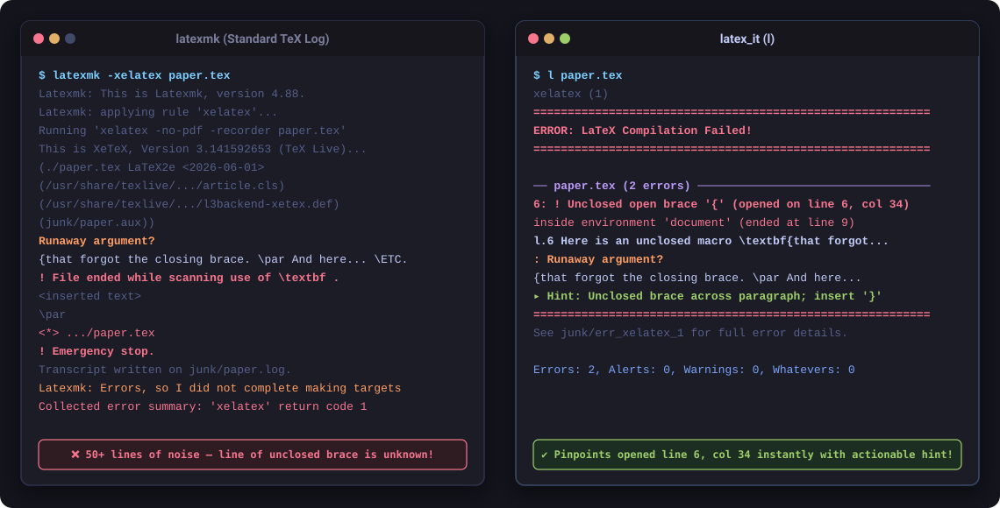

# latex_it

`latex_it` (often invoked as `l`) is an automated build tool for LaTeX documents (`xelatex`, `lualatex`, and `pdflatex`).

Like `latexmk`, it handles multi-pass compilation and bibliography dependencies automatically — but it is designed specifically to eliminate the two biggest headaches of LaTeX workflows:
1. **Cluttered directories**: Intermediate build files (`.aux`, `.log`, `.toc`, etc.) are isolated in a `junk/` directory, keeping your working tree clean.
2. **Cryptic output**: Low-level engine noise is filtered out, separating real errors and layout flaws from harmless background warnings and offering plain-English suggestions for fixes.

<p align="center">
  
</p>

---

## Quick Start

Run `l` inside any LaTeX project directory:

```bash
# Finds and compiles the main document automatically
l

# Or specify a file
l paper.tex
```

Common everyday commands:

```bash
lw          # Fast incremental rebuild (reuses cached state)
l -1        # Force a rebuild even if files haven't changed
l -C        # Clean auxiliary and temporary files
l -e        # Show plain-English explanations for errors and warnings
```

---

## Key Features

- **Clean directories**: All intermediate files (`.aux`, `.log`, `.out`, `.toc`, `.fls`, etc.) are kept in `junk/`. Only your final `.pdf`, `.bbl`, and `.synctex.gz` stay in the working directory.
- **Automatic detection**:
  - Finds your main `.tex` file if omitted (checks `.mainfile`, folder name, and `\begin{document}`).
  - Selects the right engine (`xelatex`, `lualatex`, or `pdflatex`) from magic comments or loaded packages.
  - Automatically runs Biber or BibTeX when citations or `.bib` files change.
- **Fast incremental builds**: Tracks file checksums and exits immediately if nothing changed, avoiding redundant compiler passes.
- **Actionable diagnostics**: Categorizes compiler output into Errors, Alerts, and Warnings. Adding `-e` shows plain-English suggestions on how to fix issues.
- **arXiv packaging**: Run `l --arxiv` to produce a flattened, comment-free zip archive ready for upload to arXiv (see [docs/arxiv.md](docs/arxiv.md)).

---

## Common Options

```text
Usage: l [options] [document.tex] [-- extra_files...]
```

| Option | Description |
| :--- | :--- |
| *(none)* | Build the document (auto-detects main file if omitted). |
| `--fast`, `lw` | Fast incremental mode; reuses previous state and skips unchanged passes. |
| `-1`, `--force` | Force initial LaTeX run, continuing only if needed for convergence. |
| `-u`, `--single-pass` | Run exactly one LaTeX pass without BibTeX or extra passes. |
| `-C`, `--clean-only` | Remove temporary build files and exit without compiling. |
| `-c`, `--clean` | Remove temporary build files before compiling. |
| `-e`, `--explain` | Show plain-English explanation boxes for errors and warnings. |
| `-a`, `--all` | Display all diagnostics, including suppressed minor warnings. |
| `-d`, `--diff` | Only update the target PDF if the text content actually changed. |
| `-m`, `--main` | Print the detected main LaTeX file and exit. |
| `--engine ENGINE` | Choose compiler: `xelatex` (default), `lualatex`, or `pdflatex`. |
| `-z`, `--zip` | Create a self-contained portable zip archive of the paper. |
| `--arxiv` | Prepare a sanitized, flattened zip package for arXiv submission. |
| `--init-config` | Generate a local `.l.jsonc` configuration template. |
| `-h`, `--help` | Show complete list of command-line options. |

---

## Symlink Shortcuts

The installer creates several convenient shortcuts based on the executable name:

| Command | Behavior |
| :--- | :--- |
| `l`, `latex_it` | Default build (`xelatex`, up to 3 passes, auto-bib). |
| `lw` | Fast incremental build (`--fast`). |
| `ll`, `llua` | Build using LuaLaTeX (`--engine=lualatex`). |
| `lp`, `pdflatex` | Build using pdfLaTeX (`--engine=pdflatex`). |
| `clean_latex`, `latex_clean` | Clean temporary files in current directory. |
| `latex_file_in_dir` | Print the detected main file in current directory. |

---

## Installation

### Standalone Download (No Clone Needed)
Download the latest standalone executable directly into `~/bin/` (aliased as `l`):

```bash
curl -sSL https://github.com/sarielhp/latex_it/releases/latest/download/latex_it -o ~/bin/l && chmod +x ~/bin/l
```

### From Source
Clone the repository and run the local installer:

```bash
./tools/install
```

Ensure `~/bin` is in your `PATH`.

### Requirements
- **Ruby**: 2.7 or newer.
- **TeX System**: TeX Live, MacTeX, or compatible distribution with `xelatex`, `lualatex`, or `pdflatex`.
- **Optional**: `poppler-utils` (provides `pdftotext` for PDF diffing and `pdftoppm` for visual verification).

---

## Documentation

For technical details, configuration options, and advanced features, see:

- **[docs/arxiv.md](docs/arxiv.md)**: arXiv submission packaging, flattening, comment stripping, and verification.
- **[docs/diagnostics.md](docs/diagnostics.md)**: Diagnostic tiers, error explanations, threshold settings, and semantic checks.
- **[docs/errors/README.md](docs/errors/README.md)**: Master catalog of 55 TeX/LaTeX errors with causes, solutions, and reproducers.
- **[docs/configuration.md](docs/configuration.md)**: Project configuration (`.l.jsonc`), global settings, and environment variables.
- **[docs/architecture.md](docs/architecture.md)**: Internal design, build lifecycle, and modular Ruby structure.
- **[docs/sandbox_testing.md](docs/sandbox_testing.md)**: Sandboxed testing (`bws_run`), portable paper bundles (`-z`), and REVTeX 4.0 support.
