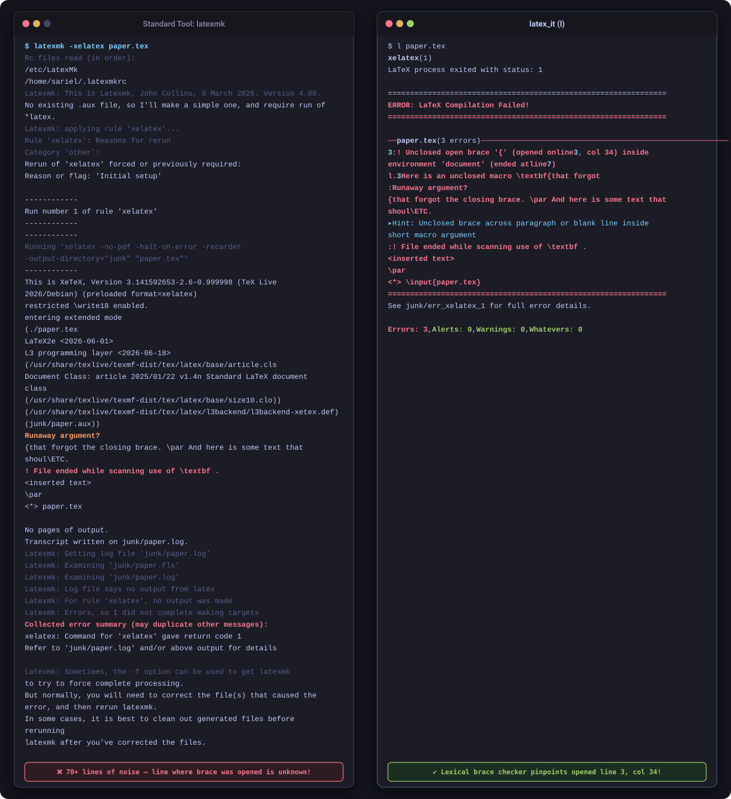
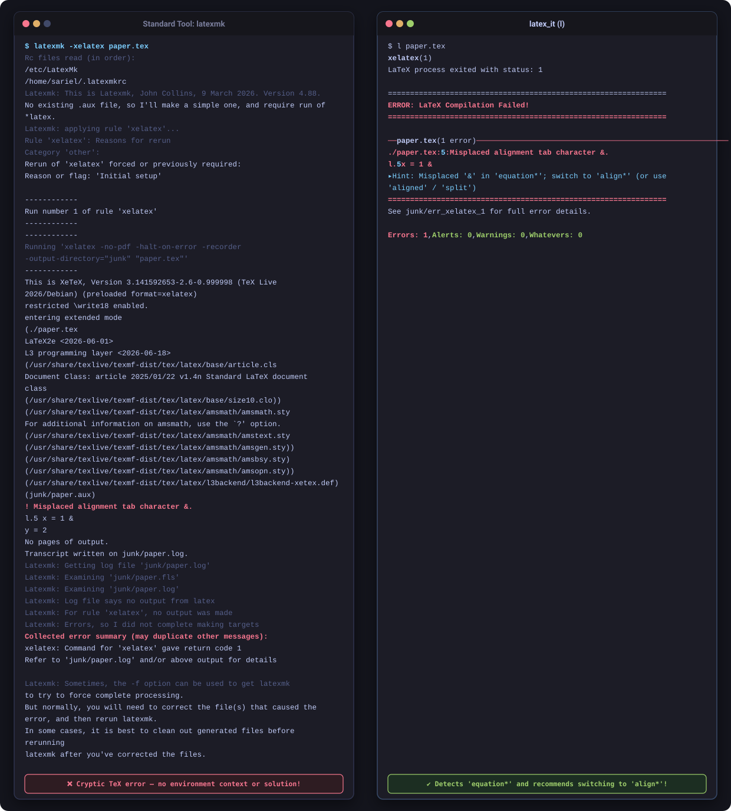
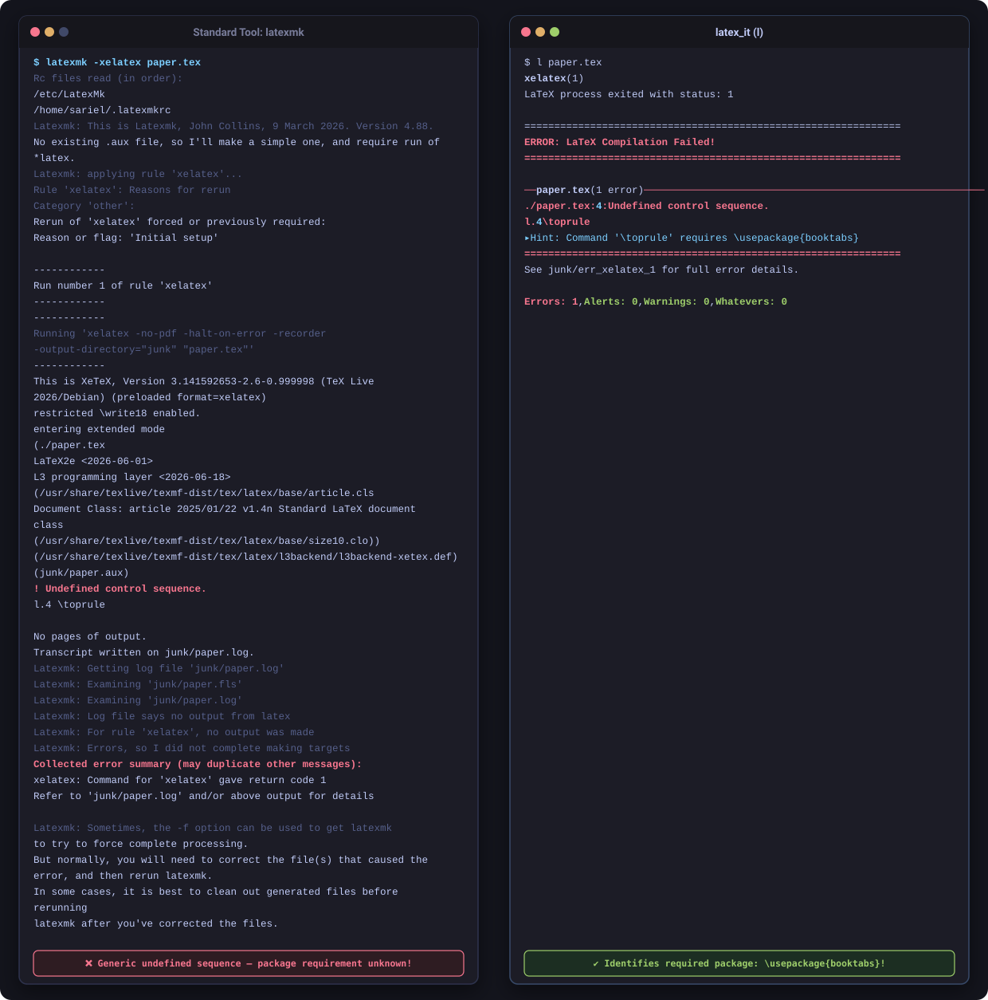
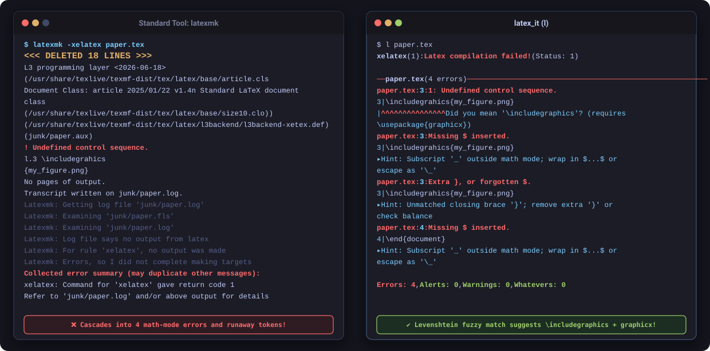
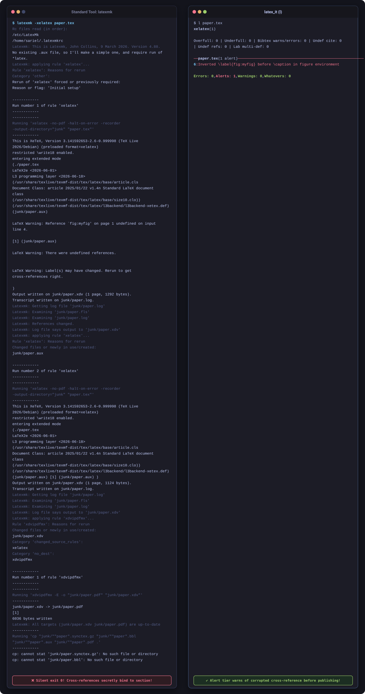
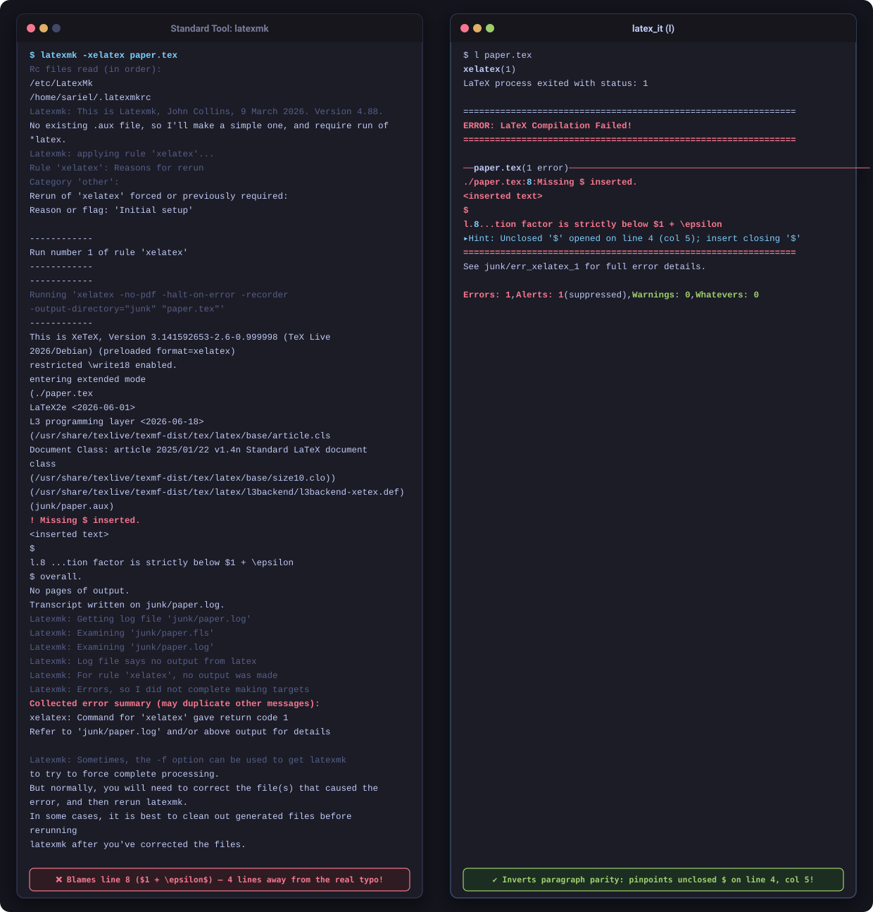

# Diagnostic Showcase Gallery

This gallery presents **unedited, real-world terminal runs** comparing standard LaTeX compilation tools (`latexmk` on `xelatex`) directly against `latex_it`.

Every comparison below was generated by running genuine compilations of both tools on the exact same `.tex` source files.

---

## 1. Unclosed Curly Brace Pinpointing

**Problem Scenario:**
A macro argument or group opened with `{` is left unclosed across a paragraph or EOF.

```latex
\documentclass{article}
\begin{document}
Here is an unclosed macro \textbf{that forgot
the closing brace.
\par
And here is some text that should not be in the bold.
\end{document}
```



### Commentary & Diagnosis

- **Standard Tool (`latexmk` / `xelatex`)**: Standard TeX parsers only complain when they encounter `\par` or EOF (`Runaway argument?`, `! File ended while scanning use of \textbf`). The terminal fills with 70+ lines of internal macro call traces and rule checks, but completely obscures where the `{` was actually typed.
- **`latex_it` Resolution**: Runs an AST-aware lexical brace scanner with environment scoping that identifies the exact line (`line 3`), column (`col 34`), and enclosing environment (`document`) where the unclosed brace started, along with an actionable remediation hint.

---

## 2. Misplaced Alignment Tab (&) inside equation*

**Problem Scenario:**
The author used `&` to align multi-part equations, but placed it inside `equation*` instead of `align*`.

```latex
\documentclass{article}
\usepackage{amsmath}
\begin{document}
\begin{equation*}
  x = 1 & y = 2
\end{equation*}
\end{document}
```



### Commentary & Diagnosis

- **Standard Tool (`latexmk` / `xelatex`)**: Standard LaTeX emits a generic `! Misplaced alignment tab character &.`, followed by 45 lines of engine state and generic failure boilerplate. It offers zero explanation of *why* the ampersand is invalid or how to structure the math environment.
- **`latex_it` Resolution**: Performs backwards AST scope resolution, detects that the tab character resides inside `equation*`, and delivers an immediate, tailored hint: `Misplaced '&' in 'equation*'; switch to 'align*' (or use 'aligned' / 'split')`.

---

## 3. Missing Package Macro (\toprule)

**Problem Scenario:**
Using standard publication-quality table markup (`\toprule`) without importing the prerequisite package.

```latex
\documentclass{article}
\begin{document}
\begin{tabular}{cc}
  \toprule
  A & B \\
\end{tabular}
\end{document}
```



### Commentary & Diagnosis

- **Standard Tool (`latexmk` / `xelatex`)**: Reports `! Undefined control sequence. <recently read> \toprule`. Standard tools do not associate macro names with external CTAN packages, leaving the author to manually look up what package supplies the command.
- **`latex_it` Resolution**: Looks up the command signature in its package index and reports: `Command '\toprule' requires \usepackage{booktabs}`.

---

## 4. Macro Spelling & Typo Fuzzy Matching (\includegrahics)

**Problem Scenario:**
A minor typo in a common macro name (`\includegrahics` instead of `\includegraphics`).

```latex
\documentclass{article}
\begin{document}
\includegrahics{my_figure.png}
\end{document}
```



### Commentary & Diagnosis

- **Standard Tool (`latexmk` / `xelatex`)**: TeX fails on the unknown macro and attempts to recover by misinterpreting underscores (`_`) in filenames as text-mode subscripts, causing a cascade of misleading secondary errors (`Missing $ inserted`, `Extra }, or forgotten $`).
- **`latex_it` Resolution**: Uses Levenshtein edit distance against standard LaTeX commands and package signatures, identifying the intended macro with: `Did you mean '\includegraphics'? (requires \usepackage{graphicx})`.

---

## 5. Inverted \label Before \caption (Silent Reference Corruption)

**Problem Scenario:**
Placing `\label{...}` before `\caption{...}` inside a floating `figure` or `table`.

```latex
\documentclass{article}
\begin{document}
\section{Introduction}\label{sec:intro}
See Figure~\ref{fig:myfig}.
\begin{figure}[htbp]
  \label{fig:myfig}
  \caption{A sample diagram.}
\end{figure}
\end{document}
```



### Commentary & Diagnosis

- **Standard Tool (`latexmk` / `xelatex`)**: Standard compilers are **completely silent** and exit with code 0. However, `\caption` is what increments the float counter; placing `\label` before it causes `\ref{fig:myfig}` to quietly bind to Section 1 instead of Figure 1, producing corrupt citations in published papers.
- **`latex_it` Resolution**: Inspects float structure and elevates this silent bug to the **Alert** diagnostic tier: `6: Inverted \label{fig:myfig} before \caption in figure environment. Move \label after or inside \caption.`

---

## 6. Unclosed Dollar Sign ($) Inversion & Pinpointing

**Problem Scenario:**
An unclosed `$` on line 4 propagates across five lines of dense mathematical prose, inverting text and math across multiple formulas until TeX crashes far downstream.

```latex
\documentclass{article}
\begin{document}

Let $S be a finite metric space containing $n$ elements.
We consider the pairwise distance matrix $D$ with entries $d(u, v) = 0$.
Under the assumption that the doubling dimension is bounded by $k$,
the geometric embedding maintains pairwise separation throughout the domain.
Finally, we obtain that the distortion factor is strictly below $1 + \epsilon$ overall.

Next section begins here.
\end{document}
```



### Commentary & Diagnosis

- **Standard Tool (`latexmk` / `xelatex`)**: TeX halts on line 8 (`$1 + \epsilon$`) with `! Missing $ inserted.`, blaming an innocent, well-formed formula for missing a dollar sign and completely concealing that math mode was opened four lines earlier on line 4.
- **`latex_it` Resolution**: Performs candidate pair scoring across the paragraph, recognizes that downstream formulas are valid, and pinpoints the true culprit: `Unclosed '$' opened on line 4 (col 5); insert closing '$'`.

---

