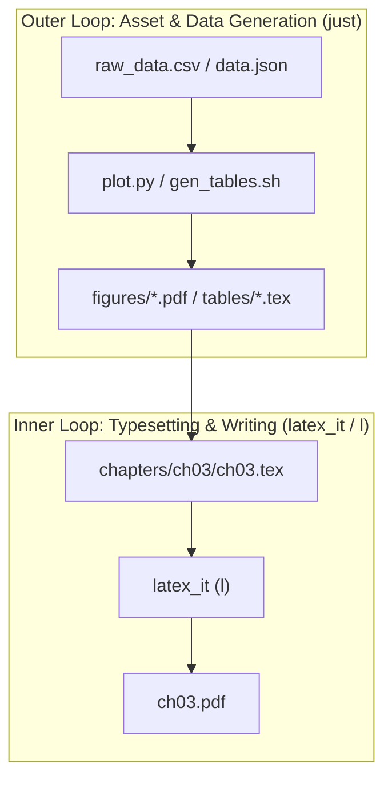

# Orchestrating Complex Multi-Chapter & Book Setups with `just`

While `latex_it` (`l`) manages the LaTeX compilation lifecycle—automating engine selection, bibliography convergence, `junk/` isolation, and diagnostic parsing—large book and multi-chapter projects often require **external upstream tasks** before LaTeX runs (such as generating plots from raw data, building shared tables, or compiling standalone figures).

This guide explains how to orchestrate complex setups using **[`just`](https://github.com/casey/just)** alongside `latex_it`.

---

## 1. The Two-Tier Workflow Architecture

The cleanest, fastest authoring workflow separates **document compilation** from **upstream asset generation**:



### The Two Modes:
1. **The Fast Inner Loop (95% of your time): Use `l`**
   - When editing prose, fixing formatting, adjusting math, or tweaking layouts, run `l` directly (or `lw` for watch mode, or editor save hooks).
   - **Performance**: Sub-second execution (0.1s–0.8s) with automatic 0-pass caching via `junk/.build_state.json`.
2. **The Asset / Upstream Update (5% of your time): Use `just`**
   - When raw data changes, new plots are created, or shared book assets need regeneration, run `just`.
   - `just` executes the upstream Python/R/data scripts and then invokes `l`.
   - `l` detects the updated SHA-256 hashes of the regenerated figures/tables and compiles the document to convergence.

---

## 2. Why `latex_it` Delegates Upstream Orchestration

`latex_it` deliberately does not crawl parent directories or execute arbitrary shell scripts from configuration files:
- **Security (No Untrusted RCE)**: Document repositories are widely shared across collaborators and students. Auto-executing shell commands from tracked project configs creates an immediate remote code execution vulnerability (CWE-426).
- **Sub-Second Latency Protection**: Running external Python or shell pipelines before every compile permanently destroys the instant sub-second feedback loop required when editing LaTeX prose.
- **Deadlock & Recursion Prevention**: If a pre-build script calls `l` internally (e.g. to compile a standalone figure), naive hook runners create infinite fork-bombs or deadlock on build locks.
- **Single Responsibility**: `l` focuses on LaTeX convergence and diagnostic accuracy. Dedicated task runners (`just`, `make`) excel at dependency tracking and recipe orchestration.

---

## 3. Recommended Book Setup (Single Root `.justfile`)

`just` natively supports hidden files (`.justfile`), allowing you to keep your project root clean without cluttering directory listings.

By leveraging `just`'s built-in **`invocation_directory()`** function, you can maintain a **single root `.justfile`** that automatically knows which chapter you are in when you run it from any subdirectory.

### Project Layout:
```text
my_book/
├── .justfile                # Root orchestrator (hidden)
├── book.tex                 # Master book document
├── scripts/
│   ├── gen_tables.py        # Shared data extraction
│   └── gen_plots.py         # Root plotting scripts
└── chapters/
    ├── ch01/
    │   ├── ch01.tex
    │   └── local_prep.sh    # Optional chapter-specific pre-build
    └── ch02/
        └── ch02.tex
```

### Root `.justfile`:
Create `.justfile` in the project root:

```just
# Default task: auto-detect directory and build appropriate target
default:
    #!/usr/bin/env bash
    set -euo pipefail

    INVOKED_DIR="{{ invocation_directory() }}"
    ROOT_DIR="{{ justfile_directory() }}"

    if [ "$INVOKED_DIR" != "$ROOT_DIR" ]; then
        echo "==> Detected chapter directory: $INVOKED_DIR"
        
        # 1. Run root shared pre-requisites
        python3 "$ROOT_DIR/scripts/gen_tables.py"
        
        # 2. Run local chapter script if one exists
        if [ -x "$INVOKED_DIR/local_prep.sh" ]; then
            (cd "$INVOKED_DIR" && ./local_prep.sh)
        fi
        
        # 3. Compile the chapter with latex_it
        (cd "$INVOKED_DIR" && l)
    else
        echo "==> Building entire book..."
        python3 "$ROOT_DIR/scripts/gen_tables.py"
        l book.tex
    fi

# Explicit recipe to compile a specific chapter by number
chapter num:
    python3 scripts/gen_tables.py
    (cd chapters/ch{{num}} && l ch{{num}}.tex)

# Full book rebuild with clean junk
clean-all:
    l -C
    rm -rf chapters/*/junk
```

---

## 4. Everyday Usage

### From any chapter subdirectory:
Navigate to Chapter 1 and type `just`:
```bash
cd chapters/ch01
just
```
`just` automatically walks up to the root `.justfile`, identifies that you are in `chapters/ch01`, runs the shared table generation, executes any local chapter prep script, and invokes `l`.

### While actively writing prose in Chapter 1:
Just use `l` directly:
```bash
l
```
Enjoy sub-second, zero-pass cached compilation without waiting on data scripts.

### From the book root:
Build the whole book:
```bash
cd /path/to/my_book
just
```
Or build a specific chapter without changing directory:
```bash
just chapter 02
```

---

## 5. Editor Integration

### Visual Studio Code
In `.vscode/tasks.json`, you can define `just` as a build task alongside `l`:

```jsonc
{
  "version": "2.0.0",
  "tasks": [
    {
      "label": "Build with Assets (just)",
      "type": "shell",
      "command": "just",
      "group": "build",
      "problemMatcher": {
        "owner": "latex",
        "fileLocation": ["relative", "${workspaceFolder}"],
        "pattern": {
          "regexp": "^([^:]+):(\\d+)(?::(\\d+))?:\\s+(error|warning|alert|note):\\s+(.*)$",
          "file": 1,
          "line": 2,
          "column": 3,
          "severity": 4,
          "message": 5
        }
      }
    }
  ]
}
```

### GNU Emacs / AUCTeX
In `.dir-locals.el` at the project root, you can set the compile command:

```elisp
((latex-mode . ((compile-command . "just"))))
```
Use `C-c C-c` to invoke `just`, or use standard AUCTeX `l` for instant text updates.
