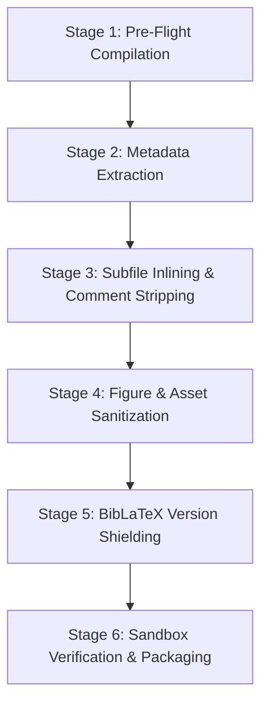

# Complete Architecture & Implementation Plan: `latex_it --arxiv`

This document defines the specification, pipeline stages, edge cases, and implementation roadmap for complete [arXiv.org](https://arxiv.org) submission preparation and metadata extraction in `latex_it`.

---

## 1. Executive Summary & Design Goals

The objective of `latex_it --arxiv` is to transform a working academic paper into a submission-ready arXiv archive (`arxiv_<document>.zip`) with zero manual editing, accompanied by extracted metadata (Title, Authors, Abstract) formatted for immediate submission.

### Core Differences: `-z` (Portable Paper) vs. `--arxiv` (arXiv Submission)

| Dimension | `-z, --zip` (Portable Paper) | `--arxiv` (arXiv Submission) |
| :--- | :--- | :--- |
| **Target PDF** | **Included** (`<file>.pdf`) for viewing | **Strictly Excluded** (arXiv must compile from source) |
| **Figure Sources** | **Included** (`.fig`, `.ipe`, `.svg`, `.asy`, `.isy`) | **Strictly Excluded** (only compiled `.pdf`/`.png` figures) |
| **Document Structure** | Multi-file structure preserved (`\input`) | **Flattened** into a single monolithic `<file>.tex` |
| **Comments** | Preserved | **Stripped** (removes internal notes, draft comments) |
| **BibLaTeX Packages** | System TeX Live packages omitted | **Bundled** (`biblatex.sty`, `*.bbx`, `*.cbx`, `*.lbx`) to shield against arXiv version mismatch |
| **Bibliography** | `.bbl` + local `.bib` included | **Only `.bbl`** (all `.bib` databases excluded) |
| **Output Archive** | `<document>.zip` | `arxiv_<document>.zip` |
| **Metadata Output** | None | Prints Title, Authors, Abstract, Comments to terminal & JSON |

---

## 2. Pipeline Architecture & Workflow

The arXiv preparation pipeline executes in 6 sequential stages:



---

### Stage 1: Pre-Flight Compilation & Convergence
1. Ensure the document is compiled to convergence:
   - Generate fresh `.aux`, `.bbl`, `.fls`, and `.bcf` / `.run.xml`.
   - Verify that citation count is stable and zero undefined references remain.
2. If the document has not yet been built or is stale, run `LatexBuilder#run!` first.

---

### Stage 2: Metadata Extraction Engine (`--meta`)
Extract and sanitize paper metadata to eliminate manual copy-pasting errors into the arXiv submission form:

1. **Title Extraction**:
   - Parse `\title{...}` or `\title[...]{...}`.
   - Strip LaTeX formatting macros (`\textbf`, `\emph`, `\mathrel`, `\\`, footnotes).
   - Convert common math notations to Unicode (e.g. `$\alpha$` $\rightarrow$ `α`, `$\mathbb{R}$` $\rightarrow$ `R`, `$O(n \log n)$` $\rightarrow$ `O(n log n)`).
2. **Authors Extraction**:
   - Parse `\author{...}` blocks, splitting multi-author declarations (`\and`, `\affil`).
   - Extract author names, email addresses, and institutions.
3. **Abstract Extraction**:
   - Extract content inside `\begin{abstract} ... \end{abstract}`.
   - Strip comment lines.
   - Clean LaTeX environments (lists, custom theorem markers) into readable plaintext paragraphs.
   - Convert math symbols to standard Unicode approximations acceptable on arXiv's plaintext abstract field.
4. **Comments & Classification**:
   - Page count: derived from the target PDF via `pdfinfo` or log.
   - Figure count: count of active figures bundled.
   - Classification: check for `\subjclass` (MSC) or ACM classifications if present in the document.
5. **Output**:
   - Write cleanly formatted plaintext metadata to `arxiv_<basename>_meta.txt` in the project root.
   - Formatted with explicit section headers (`Title:`, `Authors:`, `Comments:`, `Abstract:`) with zero JSON escaping so paragraphs can be directly copied into the arXiv web form.
   - Display a copy-pasteable summary block in the terminal.

---

### Stage 3: Subfile Inlining & Comment Stripping (`flatex` Engine)

1. **Recursive Inlining**:
   - Parse the entry-point document (`paper.tex`).
   - Recursively expand all `\input{...}` and `\include{...}` statements into a single flattened source file `<basename>.tex`.
   - Native Ruby inliner with fallback to pre-installed `/home/sariel/bin/flatex` if complex conditional constructs are detected.
2. **Comment Stripping**:
   - Strip all single-line comments (`% ...`).
   - Guard escaped percent signs (`\%`), comments inside URLs (`https://...`), and TeX magic comments (`%!TEX ...`).
   - Collapse excessive empty blank lines.
3. **Machine-Specific Macro Sanitization**:
   - Strip references to internal private host styles (e.g. `\IfFileExists{sariel_computer.sty}{...}`).
   - Strip flatex banner markers and temporary scaffolding.

---

### Stage 4: Figure & Asset Sanitization

1. **Active Figures Only**:
   - Read compiler recorder (`.fls`) to identify every image file opened during compilation.
   - Only include figures that are actively referenced in the final compiled document.
2. **Strict Raw Source Exclusion**:
   - Strip all `.fig`, `.ipe`, `.svg`, `.asy`, `.gp`, `.gnuplot`, `.py`, `.R` files.
   - Strip all editor and backup artifacts (`*.bak`, `*~`, `figs/bak/`, `figs/old/`).
3. **EPS to PDF Auto-Conversion**:
   - If an active graphic is `.eps`, verify that the converted `.pdf` (`<name>-eps-converted-to.pdf`) exists and bundle the PDF version to comply with modern pdfLaTeX/XeLaTeX requirements on arXiv.

---

### Stage 5: BibLaTeX Version Shielding (The `wrong format version` Fix)

#### The Problem on arXiv:
When using `biblatex` with Biber, arXiv's TeX Live environment may run a different version of `biblatex.sty` than your local machine. If arXiv's `biblatex` version does not match the format written into your `.bbl` file, compilation aborts with:
```text
! Package biblatex Error: File '<file>.bbl' is wrong format version - expected X.X.
```

#### The Automatic Solution:
1. Detect if the document loads `biblatex` (via `.bcf` or `\usepackage{biblatex}`).
2. Query `kpsewhich` for the exact files loaded by the local distribution:
   - `biblatex.sty`
   - `biblatex.cfg`
   - Style files: `standard.bbx`, `numeric.cbx`, `alphabetic.cbx` (whichever style is active)
   - Language files: `english.lbx`
3. Copy these `.sty`, `.bbx`, `.cbx`, and `.lbx` files directly into the root of the arXiv bundle.
4. When arXiv compiles the package, TeX Live resolves `biblatex.sty` from the submission root first, perfectly matching the uploaded `.bbl` format and preventing version mismatch errors.
5. **Exclude All `.bib` Files**: Ensure no raw `.bib` databases are included in the bundle; arXiv compiles against `<file>.bbl` directly.

---

### Stage 6: Sandbox Verification & Packaging

1. **Archive Generation**:
   - Bundle into `arxiv_<basename>.zip` exclusively (modern arXiv accepts `.zip` packages natively).
   - Layout is strictly flat or uses standard subdirectories (`figs/`):
     ```text
     arxiv_paper.zip
     ├── paper.tex            # Single flattened, comment-stripped source
     ├── paper.bbl            # Standalone bibliography
     ├── biblatex.sty         # (If biblatex used) Bundled version shield
     ├── standard.bbx         # (If biblatex used) Style definitions
     ├── alphabetic.cbx       # (If biblatex used) Citation definitions
     ├── english.lbx          # (If biblatex used) Language localization
     ├── styles/              # Harvested non-distro macros
     │   ├── sariel_colors.sty
     │   └── mathcalb.sty
     └── figs/                # Active compiled figures ONLY
         └── good_square.pdf
     ```
2. **Sandbox Portability Simulation**:
   - Extract into `/tmp/latex_it_arxiv_verify_XXXX`.
   - Run `latex_it --env-free` simulating arXiv's sterile environment (wiping `TEXINPUTS`, `BIBINPUTS`, `TEXMFHOME`).
   - Confirm compilation completes with **exit code 0**.
   - Confirm generated PDF matches original build using `pdftotext -layout`.
   - Clean up temporary sandbox.
3. **Completion Announcement**:
   - Explicitly announce both generated files in the terminal:
     ```text
     ==> arXiv Preparation Complete!
       [1] Submission Archive : arxiv_<basename>.zip (XX KB, YY files)
       [2] Paper Metadata     : arxiv_<basename>_meta.txt (ready to copy-paste into arXiv form)
     ```

---

## 3. CLI Interface Specification

### New Command-Line Switches

```text
arXiv Preparation Options:
    --arxiv [ARCHIVE]    Prepare sanitized, flattened, submission-ready arXiv zip package
    --meta               Extract and display sanitized paper metadata (Title, Authors, Abstract)
    --no-arxiv-verify    Skip isolated /tmp sandbox verification pass
    --no-biblatex-shield Skip bundling local biblatex distribution files
```

### Typical Usage Examples

```bash
# Full workflow: flatten, strip comments, bundle biblatex, verify, package to arxiv_<file>.zip:
l --arxiv

# Inspect extracted metadata only:
l --meta

# Explicit output zip name:
l --arxiv my_paper_v1.zip
```

---

## 4. Configuration Schema (`.l.jsonc`)

Add an `arxiv` block to `.l.jsonc` (and global `config.jsonc`):

```jsonc
{
  "engine": "xelatex",
  "arxiv": {
    // Automatically bundle local biblatex files to prevent version mismatch
    "bundle_biblatex": true,

    // Recursively inline all \\input and \\include statements into a single .tex file
    "flatten": true,

    // Strip private comments (% ...) from sources
    "strip_comments": true,

    // Primary and secondary arXiv category classifications (e.g. cs.CG, cs.DS)
    "categories": ["cs.CG", "cs.DS"],

    // Default comments string for submission (e.g. page count, conference details)
    "comments": "Full version with all proofs and figures"
  }
}
```

---

## 5. Implementation Milestones & Roadmap

### Milestone 1: Metadata Extractor (`LaTeXMetaExtractor`)
- Parse `\title`, `\author`, `\begin{abstract}`.
- Implement regex-based TeX math/macro converter into readable Unicode plaintext.
- Write cleanly formatted `arxiv_<basename>_meta.txt`.
- CLI switch `l --meta` printing formatted metadata and announcing `arxiv_<basename>_meta.txt`.

### Milestone 2: Source Inliner & Comment Sanitizer (`LaTeXFlattener`)
- Implement recursive `\input` / `\include` resolution.
- Implement robust comment stripping (ignoring `\%` and URLs).
- Integrate legacy `flatex` binary as high-fidelity fallback.

### Milestone 3: BibLaTeX Version Shield & Asset Packager (`LatexArxivPackager`)
- Detect BibLaTeX in `.bcf` / `.fls`.
- Harvest system `biblatex.sty`, `*.bbx`, `*.cbx`, `*.lbx` via `kpsewhich`.
- Assemble clean staging tree: flattened `.tex`, `.bbl`, active figures only.
- Build `arxiv_<name>.zip`.
- Announce both files (`arxiv_<name>.zip` and `arxiv_<name>_meta.txt`) with paths and sizes upon completion.

### Milestone 4: Verification Sandbox & Test Suite
- Simulate arXiv compiler sandbox in `/tmp`.
- Unit and regression tests in `test/test_arxiv.rb`.
- Sub-second verification via `rtk ./tools/gate`.
